I suppose this was one of the worst outages in AWS history, and it had significant impact across many internet services, products and platforms. And sadly for many of us Indians it happened on a Diwali day, and we were barely trying to keep the lights on on this festival of lights. The [AWS's public RCA](https://aws.amazon.com/message/101925/) is dense, and in PDT, so these are my notes(accurate to the best of my knowledge), concise and the timeline is in IST.

## Timeline (Converted to IST)

*(PDT -> IST = +12 hours 30 minutes)*


| Time (IST)                                           | Duration | Event Summary |
|------------------------------------------------------|----------|---------------|
| **Oct 20, 2025 – 12:18 PM -> 3:10 PM**                | ~3 hrs   | **DynamoDB DNS failure:** API errors in us-east-1 due to DNS race condition.                                                                        |
| **Oct 20, 2025 – 2:55 PM -> 5:55 PM**                 | ~3 hrs   | **EC2 lease timeout phase:** Droplet leases expired while DynamoDB was unreachable.                                                                 |
| **Oct 20, 2025 – 5:55 PM -> 7:30 PM**                 | ~1.5 hrs | **DWFM recovery congestion:** EC2 droplet recovery stalled -> throttling + restart of DWFM hosts.                                                    |
| **Oct 20, 2025 – 6:55 PM -> 9:06 PM**                 | ~2 hrs   | **Network Manager backlog:** Network state propagation delayed; new EC2s had no network connectivity.                                               |
| **Oct 20, 2025 – 7:00 PM -> 9:39 PM**                 | ~2.5 hrs | **NLB health check instability:** Alternating health check failures -> capacity removed by DNS failover.                                             |
| **Oct 20, 2025 – 11:53 PM -> Oct 21, 2025 – 3:20 AM** | ~3.5 hrs | **EC2 full recovery:** DWFM and Network Manager stabilized, throttles lifted, full recovery achieved.                                               |
| **Oct 20, 2025 – 12:21 PM -> Oct 21, 2025 – 3:50 AM** | ~15 hrs  | **Cascading impact:** Lambda, ECS, EKS, Fargate, Connect, Redshift, STS, IAM, Support all experienced downstream failures recovering in same order. |

## Notes on the Subsystems Failures

### 1. DynamoDB DNS Management System

* **DNS Planner:** Periodically generates new DNS plans mapping load balancers to endpoints.
* **DNS Enactors (3 per AZ):** Independently apply these plans to Route53 using transactions.
* **Root Cause:**
  A *race condition* occurred when a slow Enactor applied an old plan after a newer plan was already in place.

  * The stale check didn't prevent the overwrite.
  * Cleanup deleted the active plan -> **DNS record went empty** (`dynamodb.us-east-1.amazonaws.com`).
  * Required **manual repair** of Route53 entries.

**Impact:** DynamoDB endpoint unreachable -> API errors -> ripple failure in all services depending on DynamoDB (EC2, Lambda, STS, IAM, etc.).

### 2. EC2 Control Subsystems

#### (a) Droplet Workflow Manager (DWFM)

* Manages physical hosts (droplets) for EC2.
* Maintains a **lease** with each droplet to keep instance state synchronized.
* Depends on DynamoDB for state persistence.
* **Failure:** When DynamoDB failed, leases expired, and DWFM couldn't reestablish them -> **EC2 instance launches failed** with "insufficient capacity".

#### (b) Network Manager

* Propagates **network configuration** (VPC routes, IP associations, etc.) to instances.
* **Failure:** After DWFM recovery, backlog of network updates caused delays -> new instances launched but had no connectivity.

**Recovery:**

* DWFM congested -> throttled & restarted.
* Network Manager backlog cleared by ~10:36 AM PDT (9:06 PM IST).
* Full EC2 API recovery at 1:50 PM PDT (3:20 AM IST).

### 3. Network Load Balancer (NLB)

* Performs load balancing with **DNS-based health checks** per AZ.
* Health checks failed when new EC2 targets' network states weren't yet propagated.
* This caused **flapping** (nodes repeatedly removed/added).
* Degraded the health check subsystem, triggering **automatic AZ DNS failovers** -> capacity loss -> connection errors.
* Engineers **disabled automatic failover at 9:06 PM IST** -> stabilized; re-enabled after EC2 recovery (~2:39 AM IST).

## Cascading Impact to Other AWS Services

* **Lambda:** Function creation and async invocations failed due to DynamoDB and EC2 dependency; recovered by **11:45 PM IST**.
* **ECS/EKS/Fargate:** Container launch failures due to EC2 unavailability; recovered by **3:50 AM IST (Oct 21)**.
* **Connect:** Multi-phase impact - initial DynamoDB unreachability, then NLB + Lambda dependency failures; full recovery **1:50 AM IST (Oct 21)**.
* **STS/IAM:** Authentication issues due to DynamoDB outage; recovered **1:49 AM IST (Oct 20)**, relapsed briefly during NLB instability.
* **Redshift:** Dependent on DynamoDB + EC2 for query and host replacement; partial recovery **2:51 AM IST**, full by **4:35 PM IST (Oct 21)**.
* **AWS Support Console:** Failed over but blocked by invalid metadata responses -> recovered **3:10 PM IST**.

## Root Cause in One Line

A **race condition in DynamoDB's DNS automation** deleted the regional endpoint record, triggering a **chain reaction** of failures across dependent control planes - primarily **EC2 (DWFM + Network Manager)** and **NLB** - leading to multi-service disruption in us-east-1.

## Key Fixes Announced

* **DynamoDB:** Disable DNS Planner/Enactor automation; fix race condition and add safeguards.
* **EC2:** Add DWFM recovery tests, rate-limit queues dynamically, improve throttling.
* **NLB:** Add velocity controls to cap AZ failover capacity removal.
* **Cross-Service:** Broader resilience testing and dependency isolation review.

## Timeline

```mermaid
gantt
    title AWS us-east-1 Outage Timeline (Converted to IST)
    dateFormat HH:mm
    axisFormat %H:%M
    section DynamoDB
    DNS race condition & API failures        :active, 12:18, 03:10
    Manual DNS restoration completed         :done, 15:10, 15:40
    section EC2
    DWFM leases expire (due to DDB failure)  :active, 14:55, 17:55
    DWFM congestive collapse & throttling    :active, 17:55, 19:30
    Network Manager backlog (no connectivity):active, 18:55, 21:06
    EC2 throttles lifted & full recovery     :done, 23:53, 03:20
    section NLB
    Health check flapping begins             :active, 19:00, 21:09
    AZ DNS failover disabled (stabilized)    :done, 21:09, 21:39
    section Cascading Services
    Lambda errors & throttling               :active, 12:21, 23:45
    ECS / EKS / Fargate failures             :active, 12:45, 03:50
    Connect multi-phase degradation          :active, 12:26, 01:50
    STS / IAM sign-in failures               :active, 12:21, 01:49
    Redshift partial recovery                :active, 12:17, 16:35
    Support Console blocked (metadata bug)   :done, 12:18, 15:10
```



### Reading Guide

* **Left column:** Subsystem
* **Bars:** Active impact periods (converted to IST)
* **Overlap:** Shows cascading dependencies (e.g., EC2 and NLB lagged DynamoDB recovery)


## Appendix

### About DWFM Leases

#### What the Lease Is

* Each **DWFM host** manages a subset of physical machines ("droplets") that run EC2 instances.
* To **ensure authoritative control**, DWFM periodically *renews a lease* for each droplet.
* This lease confirms:

  1. The DWFM is *actively managing* that droplet.
  2. The droplet's **state (running, stopped, rebooting, etc.)** is in sync with EC2's control plane.
  3. No other DWFM host should issue commands to that droplet during the lease window.

#### Why It Matters

Leases prevent conflicting actions like:

* Two DWFM managers trying to reboot the same host simultaneously.
* A DWFM acting on stale state (e.g., thinking a droplet is idle when it's already reassigned).
* Control drift between the **EC2 API** and the **physical host reality**.


#### What Happened During the Outage

* DWFM stores its lease state in **DynamoDB**.
* When DynamoDB went unreachable, **leases expired** (DWFM couldn't renew them).
* Once expired, the droplets were **marked unmanaged**, so EC2 couldn't schedule new instances on them.
* This caused EC2 API calls to fail with **"insufficient capacity"** even though hardware was available.

When DynamoDB came back, DWFM tried to **re-establish all leases at once**, overloaded itself (a *congestive collapse*), and required throttling/restarts to recover.

#### Analogy

Think of each lease like a **"control token"** renewed every few minutes:

* If DWFM holds it -> droplet is manageable.
* If lease expires -> droplet goes offline (from EC2's point of view) until the lease is reestablished.

#### Summary

* Leases ensure authoritative control over droplets.
* DynamoDB outage caused leases to expire, leading to EC2 API failures.
* DWFM overload during lease re-establishment required throttling/restarts.

### Updates Route53 using transaction

#### What "transactions" mean in Route 53 context

When the DNS Enactor updates endpoint records (e.g., `dynamodb.us-east-1.amazonaws.com`), it doesn’t just push one record at a time.
Instead, it performs the update as a **transaction** - an **atomic "change batch"** operation.

That means:

* Multiple record changes (additions, deletions, or replacements) are grouped together.
* Either **all changes succeed**, or **none of them are applied**.
* This guarantees **consistency** of DNS state even when several Enactors are updating in parallel.

So "Route 53 using transactions" =

> *Apply DNS updates atomically via a change batch so no half-updated DNS zone ever exists.*

#### Why this matters for DynamoDB

DynamoDB maintains hundreds of thousands of DNS records for its internal load balancers.
To keep these consistent:

1. The **Planner** generates a new DNS plan (mapping LB -> weights).
2. Each **Enactor** picks up the plan and applies it to Route 53 **as a single transaction**.
3. If another Enactor tries to update at the same time, Route 53 ensures only one consistent version wins.

#### What went wrong

During the outage:

* One Enactor was delayed and tried to commit an **old plan transaction** after a newer one had already succeeded.
* Because its freshness check was stale, Route 53 accepted the transaction -> overwrote valid records.
* Then cleanup deleted that plan, leaving an **empty record set** - meaning the DNS name literally had **no A/AAAA records**, breaking all endpoint resolution.

### How did plan cleanup nullify A records?

#### What a "DNS plan" actually is

A **plan** in DynamoDB’s DNS automation is not just metadata - it’s the **authoritative configuration** that defines:

* Which load balancers (targets) should serve the endpoint
* The DNS record set (A/AAAA) for each endpoint
* The corresponding weights and health states

Think of it like a JSON object that says:

```json
{
  "endpoint": "dynamodb.us-east-1.amazonaws.com",
  "records": [
    {"ip": "54.221.10.1", "weight": 50},
    {"ip": "54.221.10.2", "weight": 50}
  ]
}
```

Each DNS Enactor reads this plan and applies it to Route 53 using a transactional update.

#### What the cleanup process does

When a new plan is successfully applied, the Enactor:

1. Marks older plans as obsolete.
2. Periodically deletes plans older than a threshold (for housekeeping).

Deletion means **removing the underlying data source** that Route 53 uses to maintain that DNS mapping.

#### What happened here

During the race condition:

1. **Enactor A (slow)** - still holding an *old plan* - applied it after a much newer plan was already in place.
2. **Enactor B (fast)** - finished applying the newest plan and then triggered the **cleanup** process, which deletes all *older plans* (including the one just incorrectly re-applied by A).
3. When cleanup deleted that plan, Route 53 no longer had any valid data for that endpoint.

Because Route 53 was told to **remove the resource record set defined by that plan**, it executed a "delete" change batch like:

```json
{
  "Action": "DELETE",
  "ResourceRecordSet": {
    "Name": "dynamodb.us-east-1.amazonaws.com",
    "Type": "A"
  }
}
```

Result:
**All A/AAAA records were wiped.**
DNS lookups for `dynamodb.us-east-1.amazonaws.com` returned **NXDOMAIN** (no such domain).

#### In simpler terms

* Each "plan" is the *source of truth* for DNS state.
* Deleting the plan = telling Route 53 that "this endpoint should no longer exist."
* So, when cleanup removed that plan, Route 53’s zone lost all IPs for that name - effectively nullifying the endpoint.

#### Why this required manual recovery

Once the plan database was inconsistent:

* No Enactor could proceed (they refused to overwrite a "missing" plan).
* Engineers had to manually restore a valid DNS record set into Route 53 to bring `dynamodb.us-east-1.amazonaws.com` back online.

> **DISCLAIMER:** I am somehow not really satisfied with the above explanation myself, but I will try to update with a better one.

---

## Unanswered questions!

### What caused the initial slowdown of one DNS Enactor?
Was it CPU contention, Route 53 API throttling, network saturation, or a dependency stall?
Understanding *why* the first Enactor lagged is crucial — without that trigger, the race condition might never have materialized.

### Why did the Enactor’s “freshness check” not re-validate before committing?
The Enactor verified plan freshness only once at start.
Shouldn’t there be a re-validation step right before applying, especially if processing is delayed?

### Why wasn’t there a safeguard preventing deletion of the *currently active* plan?
Cleanup logic deleted all “old” plans, including the one still live.
Should the system have tracked which plan is currently serving traffic before deletion?

### Why did dependent control planes (EC2 DWFM, Network Manager, NLB health checks) lack graceful degradation when DynamoDB failed?
Each subsystem cascaded failure instead of isolating or caching state.
Could stronger local caching or fallback mechanisms have prevented the multi-hour recovery chain?
